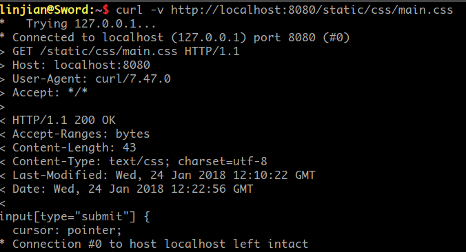
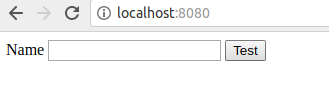
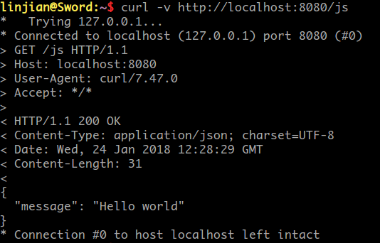
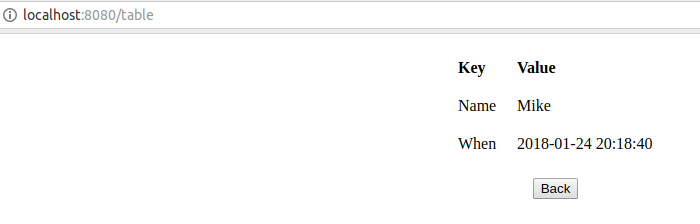
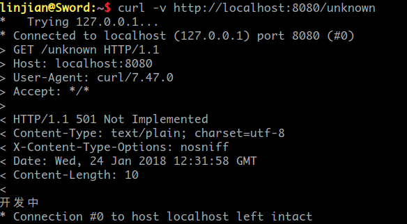

## Description

《服务计算》作业：用 Go 开发 web 应用程序 [cloudgo-io](http://blog.csdn.net/pmlpml/article/details/78539261)

## Setup

```
go get github.com/FideoJ/cloudgo-io
$GOPATH/bin/cloudgo-io
```

## 完成基本要求

### 支持静态文件服务




### 支持简单js访问



### 提交表单，并输出一个表格
支持在首页提交登录表单，显示一个包含Name和When（访问index.html的时间）的表格。


### 对 ``/unknown`` 给出开发中的提示，返回码 ``5xx``

